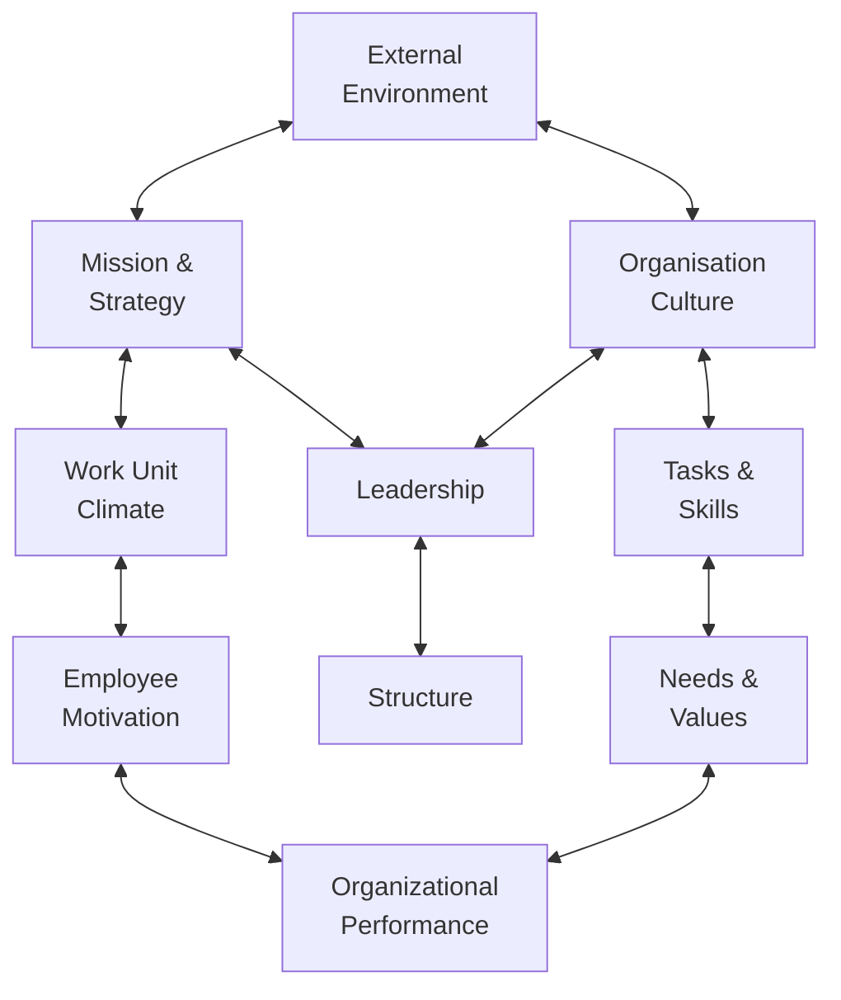

What’s Hiding in Your Code Editor?

<h2 class="text-red-400">OLS-582</h2>

This proposal explores the hidden security risks of  IDE add-ons and offers a vision for how the Research Tech Office at Urban Institute can lead by example during Cybersecurity Awareness Month.   Our goal: help researchers, developers, and leaders understand the stakes—and take smarter, scalable action.

  
    <logos:linkedin-icon /> &nbsp; <a href="https://www.linkedin.com/in/josh3/" target="_blank">Josh Miller</a> &nbsp; &nbsp; &nbsp; <twemoji-spiral-calendar /> &nbsp;Last updated:&nbsp; July 20, 2025
  

  <a href="https://github.com/joshmiller83/OLS-582-IDE-Addon-Security" target="_blank" class="slidev-icon-btn">
    <logos:git-icon />
  </a>

---
title: Setting it up, Part 1
layout: image
image: assets/ChatGPT-slide1.png
---

# Before we get into it

Context: This presentation is designed to be given to Urban Institute Stakeholders. However, this slide (and a few others that follow) are not part of the final presentation. These slides give context to my plans for this change vision.

---
title: Setting it up, Part 2
layout: image
image: assets/ChatGPT-slide1.png
---

# Before we get into it

<v-clicks depth="2" class="mt-10 text-xl">

- Organizational Context: Urban Institute is a Non-Profit Research Organization (some call it a think-tank). _**Our reputation is our hedgehog.**_
  - Hedgehog: Drive impact by Decision Makers at local, state, and national levels by providing evidence-based research.
  - Distributed research divisions that write Python and R.
- Change Vision: IDE Add-ons are an important, invisible, unregulated attack vector.
  - Feasible, focused, communicable.
  - Address using awareness efforts led by a coalition of the willing.
- Kotter's (1996) "Step 1" sense of urgency is going to come from headlines.

</v-clicks>

<!-- 
Urban Institute is a Non-Profit Research Organization (some call it a think-tank). Our reputation is _everything_.

While our IT is centralized, our programmers are distributed through-out dozens of different Research Divisions.

Our Hedgehog is simple, we want to impact the world for the better through evidence based research. This security vector directly threatens our ability to do that.

The problem is simple, Urban Institute has reputational, operational, and legal risks surrounding the security of our coding environments. I have identified an important attack vector that we have been
ignoring: The IDE Addon or Extension. If you are unaware, programmers use software to write code. This 
software is usually a general or unique use platform for additional third party plugins that support 
your unique environment. Do you want an AI to help you write tests? How about syntax highlighting? How about connecting to a database or terminal? Many of these features require third party software to be installed on our systems. Most importantly, the average programmer knows to only install legitimate looking extensions (ones that have hundreds of thousands of installs, high ratings, etc), but the platform's marketplaces are not always as secure as we think. 

I will tie this into a headline for a sense of urgency. Show people what's at stake.
-->

---
title: Setting it up, Part 3
layout: image
image: assets/ChatGPT-slide1.png
---

# Burke-Litwin Model

- Links leadership, culture, and external drivers
- Our culture and mission (transformational elements) fit this change.
- Leadership / stakeholders have recommended us to proceed

---
title: Setting it up, Part 4
layout: image
image: assets/ChatGPT-slide1.png
---

# Let's dive in!

The following slides are the presentation I plan to record and send out to all programmers, calling for a coalition of the willing.

---
title: Start Coalition Building Presentation
layout: image
image: assets/ChatGPT-slide1.png
---

What’s Hiding in Your Code Editor?

This proposal explores the hidden security risks of IDE add-ons and offers a vision for how we can raise some awarness and support our mission of impact.   The goal: help researchers, developers, and leaders understand the stakes—and take smarter, scalable action.

---
title: The Risk
layout: image
image: assets/ChatGPT-slide2-v2.png
---

One unvetted add-on quietly exfiltrated everything.

  
<twemoji-money-with-wings />
  Just a few days ago
  , a developer lost $500,000 after installing a fake VSCode extension.

  
  
<twemoji-magic-wand />
  The attacker manipulated the VS Code Marketplace 
  to make the malicious plugin appear trustworthy.

  
<twemoji-bug />
  Once installed, the add-on deployed malware 

  
<twemoji-boomerang />
  Even after removal, the attacker returned 
  with slight name changes and similar download manipulation.

  
<twemoji-warning />
  This was a systemic blind spot. 
  Organizations need their own controls, awareness, and policy frameworks.

  
Source: <a href="https://www.scworld.com/news/fake-visual-studio-code-extension-for-cursor-led-to-500k-theft" target="_blank">SCWorld (July 2025)</a>

---
title: What Are IDE Add-Ons
layout: image
image: assets/ChatGPT-slide3.png
---

  

    
What Are IDE Add-Ons? Why Should We Care?

    
These are extensions we use in VS Code, RStudio, PHPStorm, Cursor, etc. to improve productivity.

  

  

    
IDE Addons often run with full access to your terminal, files, repositories, possibly environment secrets.

  

---
title: Urban Institute is Vulnerable Today
layout: image
image: assets/ChatGPT-slide4.png
---

  

    
Urban Institute Development Environments Are Vulnerable Today

    
We have no formal plugin review process.

  

  

    
Add-ons can access: Private repos, Internal data, Shared Network Drives

    
Developers install them with good intent—but there’s no shared guardrails.

  

---
title: Why Now?
layout: image
image: assets/ChatGPT-slide5.jpg
---

  

    
Why Now?

  

  

    
<twemoji-check-mark-button class="-ml-12" /> &nbsp; External threats are more sophisticated.

    
<twemoji-check-mark-button class="-ml-12" /> &nbsp; Internal practices are uneven.

    
<twemoji-check-mark-button class="-ml-12" /> &nbsp; October gives us a natural moment to educate and align.

  

---
title: Proposal
layout: image
image: assets/ChatGPT-slide6.png
---

  

   
The Proposal

  
<twemoji-eye class="-ml-12" /> &nbsp; <strong class="text-purple-200">Awareness</strong>: Lunch talk, Slack tip, and simple visuals about plugin risk.

  
<twemoji-shield class="-ml-12" /> &nbsp; <strong>Guidance</strong>: Lightweight, co-authored “Plugin Vetting” best practices.

  

  

  
<twemoji-family-woman-girl-boy class="-ml-12" /> &nbsp; <strong>Pilot</strong>: A volunteer group to review current plugin usage and create guidance.

  
<twemoji-spiral-calendar class="-ml-12" /> &nbsp; <strong>Timeline</strong>: Plan to launch guardrails by October.

  

---
title: What Success Looks Like
layout: image
image: assets/ChatGPT-slide7.png
---

# What Success Looks Like

* Developers understand the risk.
* Teams have a clear, practical way to assess plugins.
* We’ve piloted guidance in one or two dev-heavy teams.

---
title: Built to Fit Our Culture
layout: image
image: assets/ChatGPT-slide8.png
---

# Built to Fit Our Culture

* Not a mandate. No one’s blocking extensions.
* Built by devs, for devs—fast feedback loops.
* Respects Urban’s Divisions' independence while nudging us toward security.

---
title: Low Lift, High Value
layout: image
image: assets/ChatGPT-slide9.png
---

  

  

# Low Lift, High Value
* No new tools needed.
* No new software to deploy.
* Just clarity, visibility, and smarter habits.

---
title: Want to Help?
layout: image
image: assets/ChatGPT-slide10.png
---

  

  

# Want to Help?

I’m asking for volunteers to

* Draft best practices
* Share what's working
* Pilot ideas in October

No long meetings. Just honest feedback and a little collaboration.

---
title: Q&A
layout: image
image: assets/ChatGPT-slide11.png
---

I want your feedback and I'm open to questions

“What would make this effort useful to your team?”

“What concerns do you have about vetting plugins?”  “Who else should I talk to?”

---
title: Future is bright
layout: image
image: assets/ChatGPT-slide12.png
---

Thank you for your time!

Securing our development environments is critical to our ability to make impact.

Contact <strong>Josh Miller</strong> if interested in joining the coalition.

---
title: References
---

<twemoji:books />&nbsp; References 

  
Burke, W. W. (2011). Organization change: Theory and practice (3rd ed.). Sage Publications.   Kotter, J. P. (1996). Leading change. Harvard Business School Press.  SC World. (2025, July 11). Fake Visual Studio Code extension for Cursor led to $500k theft. https://www.scworld.com/news/fake-visual-studio-code-extension-for-cursor-led-to-500k-theft

Reflections, structure, and design are by Josh Miller. Collaborated with ChatGPT to create visuals.

